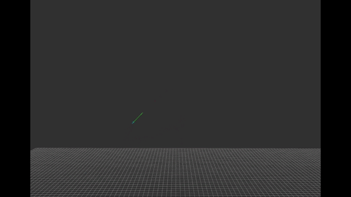
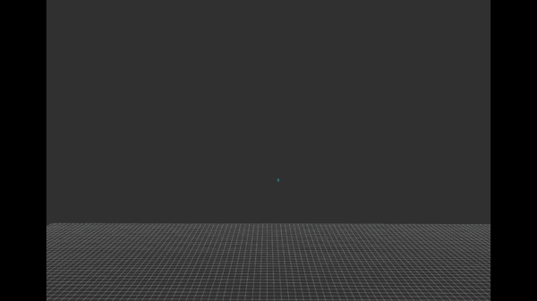
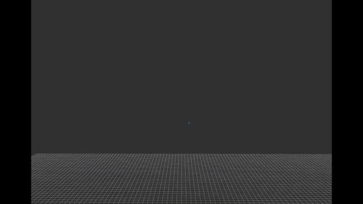

# AA-Evasion: Anti-Air Evasion Drone

> Deep reinforcement learning for UAV survival under predictive anti-air fire in a PX4 + Gazebo simulation.



A quadcopter learns to **survive** against a turret that uses **perfect lead-shot aiming**. Instead of unrealistic per-bullet tracking, the agent observes incoming projectile state and learns evasive maneuvers with **PPO (Proximal Policy Optimization)** in a custom Gymnasium environment wired to ROS 2 and PX4 Offboard control.

---

## What This Project Does

| Goal | Description |
| :--- | :--- |
| **Survival** | Dodge high-rate anti-air fire while staying airborne |
| **Realistic sensing** | Observations based on projectile position & velocity (not omniscient aim vectors) |
| **Sim-to-real stack** | ROS 2 Humble · PX4 SITL · Gazebo Classic · Stable-Baselines3 |

The turret predicts the drone's future position and fires physical projectiles. The drone must break predictable flight paths with jinking, timing, and minimal-but-effective motion — a **"Lazy Survivor"** policy that prefers small corrections near a home position.

---

## Curriculum Learning

Training difficulty increases in three stages. Each level uses faster bullets and higher fire pressure so the agent generalizes instead of overfitting to a single threat profile.

### Level 1 — Slow projectiles, low fire rate

The agent first learns basic survival: stay airborne, recognize incoming threats, and make its first successful dodges.



- Bullet speed: ~50 m/s  
- Fire rate: ~120 RPM  

### Level 2 — Medium speed & fire rate

Reaction windows shrink. The policy must commit to evasive motion earlier and more decisively.



- Bullet speed: ~200 m/s  
- Fire rate: ~300 RPM  

### Level 3 — Full threat (final policy)

Near-realistic intercept conditions. The trained agent shown at the top of this README completes this stage.


- Bullet speed: ~850 m/s  
- Fire rate: ~600 RPM  

---

## Tech Stack

| Component | Detail |
| :--- | :--- |
| **OS** | Ubuntu 22.04 LTS (WSL2 supported) |
| **Middleware** | ROS 2 Humble |
| **Simulator** | Gazebo Classic 11 |
| **Flight stack** | PX4-Autopilot (SITL), 3DR Iris |
| **RL** | Gymnasium, Stable-Baselines3 (PPO) |
| **Language** | Python 3.10 |

---

## Project Structure

```
air_defense_evasion_drone_project/
├── README.md                 # Project overview (this file)
├── RUN.md                    # Step-by-step execution guide
├── INSTALL.md                # Installation instructions
├── assets/                   # Demo GIFs (curriculum levels)
├── requirements.txt
├── dependencies.repos
├── setup_environment.sh
└── ros2_ws/
    └── src/flight_control/
        └── flight_control/
            ├── drone_env_new.py      # Mission + evasion environment
            ├── only_dodge_env.py     # Lazy Survivor (home defense) environment
            ├── turret_sim_new.py     # Projectile turret simulator
            ├── train.py              # PPO training (mission env)
            ├── train_only_dodge.py   # PPO training (survival env)
            └── rule_based_test.py    # Rule-based dodge baseline
```

Large dependencies (**PX4-Autopilot**, **Micro-XRCE-DDS-Agent**, **px4_msgs**) are installed locally and excluded from git — see [INSTALL.md](INSTALL.md).

---
## RL Design (Summary)

**Observation (12-D):** home-relative position, self velocity, nearest threat bullet relative position & velocity  

**Action (3-D):** normalized velocity commands → PX4 Offboard velocity control  

**Reward (Lazy Survivor):** alive bonus, distance-from-home penalty outside a safe radius, energy penalty for unnecessary motion, large death penalty on hit / crash / boundary exit  

**Hit detection:** continuous collision check along each bullet segment per simulation step
---
## Getting Started

1. **[Installation Guide](INSTALL.md)** — ROS 2, Gazebo, PX4, Python packages  
2. **[Run Guide](RUN.md)** — Launch agent, SITL, turret, and training (5 terminals)

Quick command summary:

```bash
# Terminal 1
MicroXRCEAgent udp4 -p 8888

# Terminal 2
cd ~/PX4-Autopilot && HEADLESS=1 PX4_SIM_SPEED_FACTOR=3 make px4_sitl gazebo-classic_iris

# Terminal 3
cd ros2_ws && source install/setup.bash && ros2 run flight_control turret_sim_new

# Terminal 4
cd ros2_ws/src/flight_control/flight_control && python3 train_only_dodge.py
```

Full troubleshooting, TensorBoard, and parameter tuning: **[RUN.md](RUN.md)**.

